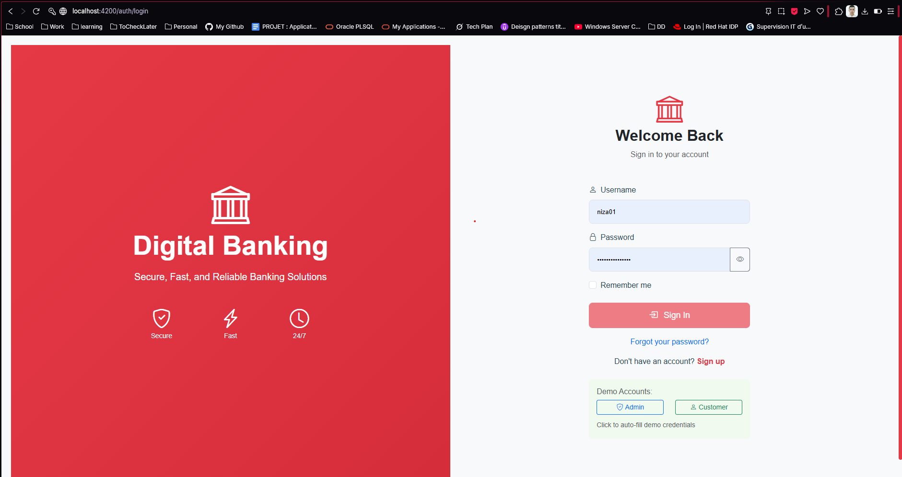

# 🏦 Digital Banking Frontend

A modern Angular 19 frontend application for the Digital Banking system, featuring responsive design, real-time dashboards, and comprehensive banking operations for both administrators and customers.


## 🌟 Overview

This Angular frontend provides a complete user interface for the Digital Banking application with separate dashboards for administrators and customers. Built with Angular 19, Bootstrap 5, and Chart.js, it offers a modern, responsive, and intuitive banking experience.

## ✨ Key Features

### 🔐 Authentication & Security

- **JWT-based Authentication**: Secure token-based authentication
- **Role-based Access Control**: Separate admin and customer interfaces
- **Auto-logout**: Automatic session management
- **Route Guards**: Protected routes based on user roles

### 👨‍💼 Admin Interface

- **Comprehensive Dashboard**: Real-time banking statistics and charts
- **Customer Management**: Complete CRUD operations for customers
- **Account Management**: Create and manage customer accounts
- **Transaction Monitoring**: View and manage all transactions
- **Banking Operations**: Perform credit, debit, and transfer operations
- **User Management**: Manage system users and roles

### 👤 Customer Interface

- **Personal Dashboard**: Account overview and recent transactions
- **Account Management**: View account details and balances
- **Banking Operations**: Perform deposits, withdrawals, and transfers
- **Transaction History**: Complete transaction history with filtering
- **Account Opening**: Request new accounts

### 🎨 Modern UI/UX

- **Responsive Design**: Mobile-first responsive layout
- **Bootstrap 5**: Modern UI components and styling
- **Interactive Charts**: Real-time data visualization with Chart.js
- **Bootstrap Icons**: Comprehensive icon library
- **Dark/Light Theme**: Theme switching capability

## 🛠 Technology Stack

- **Angular 19** - Latest Angular with standalone components
- **TypeScript** - Type-safe JavaScript development
- **Bootstrap 5.3.6** - Modern responsive UI framework
- **Bootstrap Icons 1.13.1** - Comprehensive icon library
- **Chart.js 4.4.9** - Interactive data visualization
- **RxJS 7.8** - Reactive programming for Angular
- **@auth0/angular-jwt 5.2.0** - JWT handling for Angular
- **Angular SSR** - Server-side rendering support

## 🖥️ User Interfaces

> **Note**: All screenshots below are included in the `assets/` folder of this project for easy reference and documentation purposes.

### 🔑 Authentication

Secure login interface with role-based redirection.



### 👨‍💼 Admin Interface

#### Admin Dashboard

Comprehensive overview with statistics, charts, and quick actions.


#### Customer Management

Complete customer management with search and filtering.


#### Account Management

Account creation and management interface.


#### Banking Operations

Administrative banking operations interface.


#### Transaction Management

Comprehensive transaction monitoring and management.


### 👤 Customer Interface

#### Customer Dashboard

Personal banking dashboard with account overview.


#### Account Management

Customer account view and management.


#### Banking Operations

Customer banking operations interface.


#### Transaction History

Complete transaction history with filtering.


## 🚀 Getting Started

### Prerequisites

- **Node.js 18+** - JavaScript runtime
- **npm 9+** or **yarn** - Package manager
- **Angular CLI 19+** - Angular command line interface

### Installation

1. **Clone the repository**

   ```bash
   git clone <repository-url>
   cd Digital Banking/dig_bank_frontend
   ```

2. **Install dependencies**

   ```bash
   npm install
   ```

3. **Configure environment**

   Update `src/environments/environment.ts` if needed:

   ```typescript
   export const environment = {
     production: false,
     apiUrl: "http://localhost:8085/api",
     // ... other configurations
   };
   ```

4. **Start development server**

   ```bash
   npm start
   # or
   ng serve
   ```

5. **Access the application**
   - **Frontend URL**: `http://localhost:4200`
   - **Backend API**: `http://localhost:8085` (must be running)

### Default Credentials

#### Admin Access

- **Username**: `admin`
- **Password**: `admin123`

#### Customer Access

- **Username**: `abdelkrim`
- **Password**: `password123`

## 🏗️ Project Structure

```
dig_bank_frontend/
├── src/
│   ├── app/
│   │   ├── admin/              # Admin-specific components
│   │   │   ├── components/     # Admin UI components
│   │   │   ├── services/       # Admin services
│   │   │   └── models/         # Admin data models
│   │   ├── customer/           # Customer-specific components
│   │   │   ├── components/     # Customer UI components
│   │   │   ├── services/       # Customer services
│   │   │   └── models/         # Customer data models
│   │   ├── auth/               # Authentication module
│   │   │   ├── components/     # Login/register components
│   │   │   ├── services/       # Auth services
│   │   │   ├── guards/         # Route guards
│   │   │   └── interceptors/   # HTTP interceptors
│   │   ├── core/               # Core services and utilities
│   │   │   ├── services/       # Core services
│   │   │   └── interceptors/   # Global interceptors
│   │   ├── shared/             # Shared components and services
│   │   │   ├── components/     # Reusable components
│   │   │   ├── services/       # Shared services
│   │   │   ├── models/         # Data models and DTOs
│   │   │   └── pipes/          # Custom pipes
│   │   ├── navigation/         # Navigation components
│   │   └── app.component.ts    # Root component
│   ├── assets/                 # Static assets
├── assets/                     # Project documentation assets
│   ├── admin/                  # Admin interface screenshots
│   └── customer/               # Customer interface screenshots
│   ├── environments/           # Environment configurations
│   └── styles.css              # Global styles
├── public/                     # Public assets
├── angular.json                # Angular configuration
├── package.json                # Dependencies and scripts
└── tsconfig.json               # TypeScript configuration
```

## 🧪 Testing

### Unit Tests

```bash
npm test
```

### E2E Tests

```bash
npm run e2e
```

### Linting

```bash
npm run lint
```

## 🚀 Build & Deployment

### Development Build

```bash
npm run build
```

### Production Build

```bash
npm run build:prod
```

### Serve Production Build

```bash
npm run serve:prod
```

## 🔧 Configuration

### Environment Configuration

#### Development (`src/environments/environment.ts`)

```typescript
export const environment = {
  production: false,
  apiUrl: "http://localhost:8085/api",
  endpoints: {
    auth: {
      login: "/auth/login",
      register: "/auth/register",
    },
    // ... other endpoints
  },
  testCredentials: {
    admin: { username: "admin", password: "admin123" },
    customers: [
      { username: "abdelkrim", password: "password123" },
      // ... other customers
    ],
  },
};
```

#### Production (`src/environments/environment.prod.ts`)

```typescript
export const environment = {
  production: true,
  apiUrl: "https://your-api-domain.com/api",
  // ... production configurations
};
```

### Angular Configuration

Key configurations in `angular.json`:

```json
{
  "projects": {
    "dig_bank_frontend": {
      "architect": {
        "build": {
          "options": {
            "outputPath": "dist/dig_bank_frontend",
            "index": "src/index.html",
            "main": "src/main.ts",
            "styles": ["node_modules/bootstrap/dist/css/bootstrap.min.css", "node_modules/bootstrap-icons/font/bootstrap-icons.css", "src/styles.css"]
          }
        }
      }
    }
  }
}
```

## 📦 Available Scripts

| Script               | Description              |
| -------------------- | ------------------------ |
| `npm start`          | Start development server |
| `npm run build`      | Build for development    |
| `npm run build:prod` | Build for production     |
| `npm test`           | Run unit tests           |
| `npm run e2e`        | Run e2e tests            |
| `npm run lint`       | Run linting              |
| `npm run serve:ssr`  | Serve with SSR           |

## 🎨 Styling & Theming

### Bootstrap Integration

The application uses Bootstrap 5 for styling:

```scss
// Global styles in styles.css
@import "~bootstrap/dist/css/bootstrap.min.css";
@import "~bootstrap-icons/font/bootstrap-icons.css";

// Custom variables
:root {
  --primary-color: #007bff;
  --secondary-color: #6c757d;
  --success-color: #28a745;
  --danger-color: #dc3545;
  --warning-color: #ffc107;
  --info-color: #17a2b8;
  --light-color: #f8f9fa;
  --dark-color: #343a40;
}
```

### Custom Components

The application includes custom styled components:

- **Navigation Bar**: Responsive navigation with role-based menu items
- **Dashboard Cards**: Statistical cards with icons and animations
- **Data Tables**: Sortable and filterable tables
- **Forms**: Styled forms with validation
- **Charts**: Interactive charts with Chart.js integration

## 🔒 Security Features

### Authentication Flow

1. **Login**: User submits credentials
2. **JWT Token**: Backend returns JWT token
3. **Token Storage**: Token stored in localStorage
4. **Auto-Refresh**: Token automatically refreshed
5. **Route Protection**: Guards protect routes based on roles

### Route Guards

```typescript
// Auth Guard
@Injectable()
export class AuthGuard implements CanActivate {
  canActivate(): boolean {
    return this.authService.isAuthenticated();
  }
}

// Role Guard
@Injectable()
export class RoleGuard implements CanActivate {
  canActivate(route: ActivatedRouteSnapshot): boolean {
    const requiredRole = route.data["role"];
    return this.authService.hasRole(requiredRole);
  }
}
```

### HTTP Interceptors

```typescript
// Token Interceptor
@Injectable()
export class TokenInterceptor implements HttpInterceptor {
  intercept(req: HttpRequest<any>, next: HttpHandler): Observable<HttpEvent<any>> {
    const token = this.authService.getToken();
    if (token) {
      req = req.clone({
        setHeaders: { Authorization: `Bearer ${token}` },
      });
    }
    return next.handle(req);
  }
}
```

## 🤝 Contributing

1. **Fork the repository**
2. **Create a feature branch**
   ```bash
   git checkout -b feature/amazing-feature
   ```
3. **Make your changes**
4. **Follow coding standards**
   - Use TypeScript best practices
   - Follow Angular style guide
   - Write unit tests for components
   - Update documentation
5. **Test your changes**
   ```bash
   npm test
   npm run lint
   ```
6. **Commit your changes**
   ```bash
   git commit -m 'Add some amazing feature'
   ```
7. **Push to the branch**
   ```bash
   git push origin feature/amazing-feature
   ```
8. **Submit a pull request**

## 📝 License

This project is licensed under the MIT License - see the [LICENSE](../LICENSE) file for details.

## 📞 Support

For support and questions:

- **Email**: support@digitalbanking.com
- **GitHub Issues**: [Create an issue](https://github.com/bellagnech/digital-banking/issues)
- **Documentation**: [Wiki](https://github.com/bellagnech/digital-banking/wiki)

---
